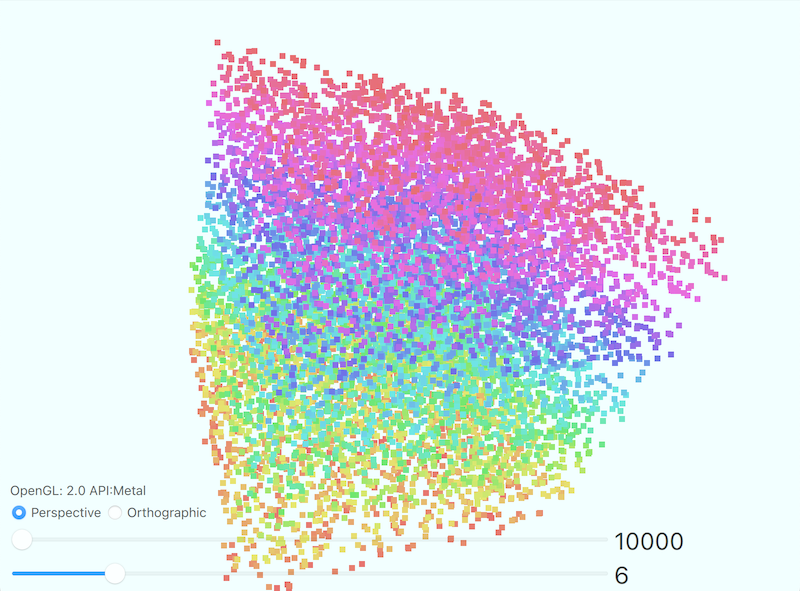

# PointSize_Qt6_Quick3D
Qt 6のQt Quick 3Dを使って、ポイントサイズを変更するサンプルアプリ

## Demo

* マウスドラッグでキューブを回せます。
* スライダーでポイント数とサイズを変えられます。

## Features

これまでQMLだけで点群のポイントサイズを変えられなかったが、Qt6からQuick 3DのDefaultMaterialにプロパティ値を変更するだけで表示が変えられるようになりました。
ポイントの形状は正方形になります。

## Requirement

* Qt Creator
* CMake
* Qt 6.6.0
